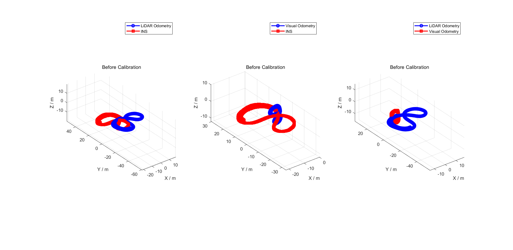
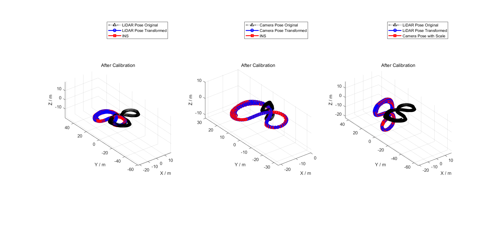

# Hand_Eye_Extrinsic_Calibration

**This repository is currently in progress.**

MATLAB code for LiDAR-Camera-INS extrinsic calibration based on hand-eye calibration method. The extrinsic between these three sensors can be calculated separately or in a fully connected manner.

## 1. Prerequisites

1. Ubuntu (tested on 16.04 and 18.04) and ROS (tested on Kinetic and Melodic).
2. [My fork](https://github.com/zxl19/rosbag_to_csv) of [rosbag_to_csv](https://github.com/AtsushiSakai/rosbag_to_csv).
3. MATLAB (tested on 2020a, with Robotics System Toolbox installed).

## 2. Input Pose Format

The inputs of the algorithms are LiDAR, camera and INS pose estimates in the following format:

```text
timestamp x y z qw qx qy qz
```

In order to avoid numerical error caused by the loss of precision during conversion, the input files are in `.mat` format. In the `/tools` folder are codes to convert file formats. Refer to the `README.md` file [there](./tools/README.md) for further instructions.

## 3. Calibration

1. Change pose filenames.
2. Run `main_calibration_L2I_*.m` for LiDAR-INS extrinsic calibration.
3. Run `main_calibration_C2I_*.m` for camera-INS extrinsic calibration.
4. Run `main_calibration_L2C_*.m` for LiDAR-camera extrinsic calibration.
5. Run `main_calibration_FCPE_*.m` for fully connected extrinsic calibration.

PS: The rotation part of the extrinsic can be represented by euler angles, quaternions or 9 elements of the rotation matrix. We have implemented those 3 representations respectively by optimizing `x y z yaw pitch roll` or `x y z qw qx qy qz` or `x y z r_11 r_12 r_13 r_21 r_22 r_23 r_31 r_32 r_33`[^1]. They are represented by the following suffixes:

- `eul`: Use euler angles to represent rotation.
- `quat`: Use quaternions to represent rotation.
- `12`: Use 9 elements of the rotation matrix to represent rotation.

PPS: Initially, the correspondence between poses were determined by timestamp synchronization. To get enough pose pairs for calibration, we use cubic interpolation to smooth the translation part and spherical linear interpolation (SLERP) to smooth the rotation part of the poses represented by quaternions:

- `quat_interp`: (**recommended**)

## 4. Results

### 4.1 LiDAR to INS

<p align = "center">
    
    
</p>

### 4.2 Camera to INS

<p align = "center">
    
    
</p>

### 4.3 LiDAR to Camera

<p align = "center">
    
    
</p>

### 4.4 Fully Connected Pose Estimation (FCPE)

<p align = "center">
    
</p>

<p align = "center">
    
</p>

[^1]: Dornaika F, Horaud R. Simultaneous Robot-World and Hand-Eye Calibration[J]. IEEE Trans Robotics Automat, 1998, 14(4):617-622. [[LINK](https://ieeexplore.ieee.org/document/704233)]
