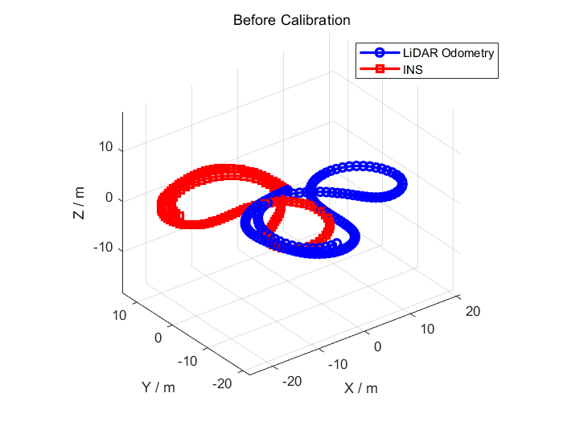
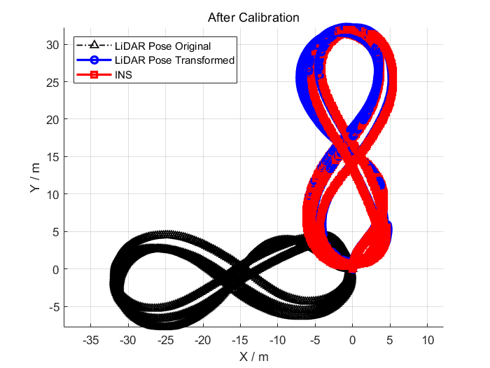
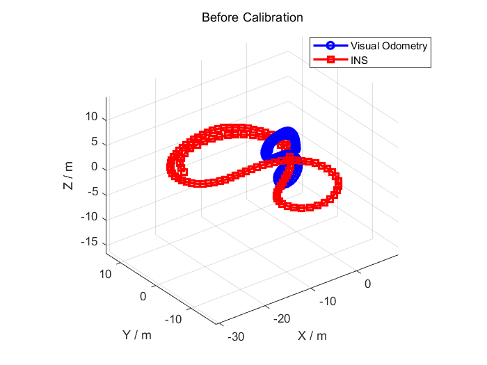
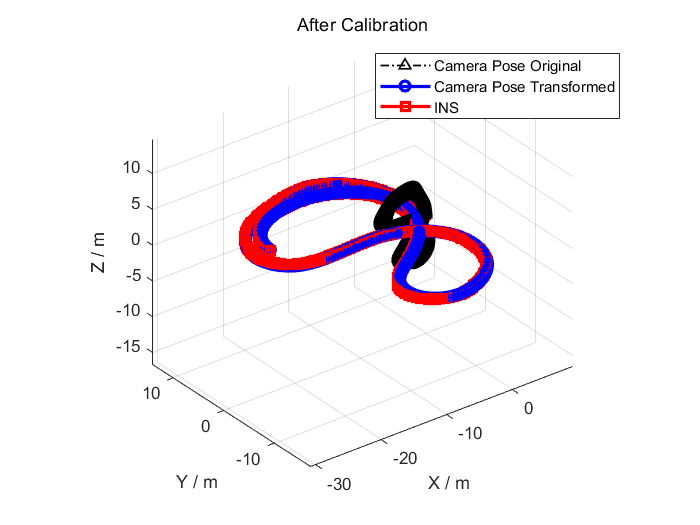

# Hand_Eye_Extrinsic_Calibration

**This repository is currently in progress.**

MATLAB code for LiDAR-INS and Camera-INS extrinsic calibration based on hand-eye calibration method.

The rotation part of the extrinsic can be represented by euler angles, quaternions or 9 elements of the rotation matrix. We have implemented those 3 representations respectively by optimizing `x y z yaw pitch roll` or `x y z qw qx qy qz` or `x y z r_11 r_12 r_13 r_21 r_22 r_23 r_31 r_32 r_33`[^1].

## 1. Prerequisites

1. Ubuntu (tested on 16.04) and ROS (tested on Kinetic).
2. [My fork](https://github.com/zxl19/rosbag_to_csv) of  [rosbag_to_csv](https://github.com/AtsushiSakai/rosbag_to_csv).
3. MATLAB (tested on 2020a, with Robotics System Toolbox installed).

## 2. Input Pose Format

The inputs of the algorithms are LiDAR, camera and INS pose estimates in the following format:

```text
timestamp x y z qw qx qy qz
```

In order to avoid numerical error caused by the loss of precision during conversion, the input files are in `.mat` format. In the `/tools` folder are codes to convert file formats. Refer to the `README.md` file [there](./tools/README.md) for further instructions.

## 3. Calibration

1. Change pose filenames.
2. Run `main_calibration_L2I_*.m` for LiDAR-INS extrinsic calibration. Run `main_calibration_C2I_*.m` for camera-INS extrinsic calibration.
    - `eul`: Use euler angles to represent rotation.
    - `quat`: Use quaternions to represent rotation.
    - `12`: Use 12 elements of the rotation matrix to represent rotation.
    - `quat_interp`: Use quaternions to represent rotation. Instead of synchronizing timestamps, we use cubic interpolation to smooth translation and spherical linear interpolation (SLERP) to smooth rotation. (**recommended**)

## 4. Results

### 4.1 LiDAR to INS

<center class="half">
    
</center>

## 4.2 Camera to INS

<center class="half">
    
</center>

## 5. Reference

1. [MATLAB-GPS-Calculations](https://github.com/alexbuczynsky/MATLAB-GPS-Calculations)

[^1]: Dornaika F, Horaud R. Simultaneous Robot-World and Hand-Eye Calibration[J]. IEEE Trans Robotics Automat, 1998, 14(4):617-622. [[LINK](https://ieeexplore.ieee.org/document/704233)]
